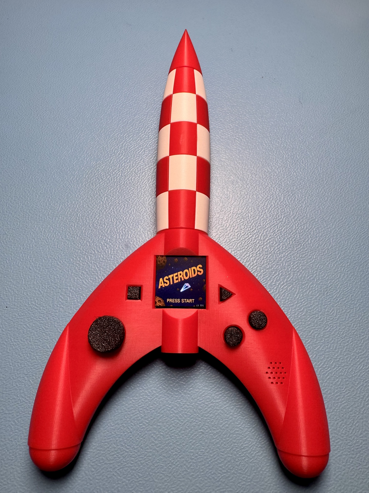
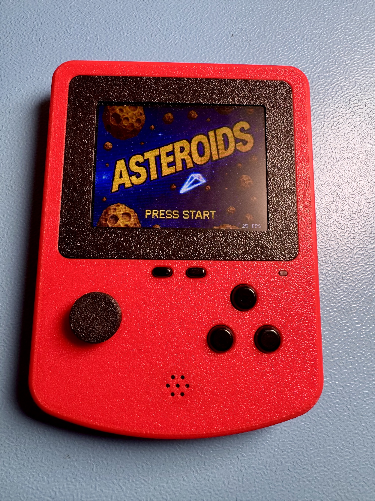

# VectorArcade

Two handheld game consoles, one firmware. VectorArcade plays **Lunar Lander** and
**Asteroids** - the two vector arcade classics of 1979 - redrawn as line graphics on an
ESP32 with a colour TFT, an analog joystick and I2S sound. The same sketch builds for both
consoles: the **LittleGameConsole** (320x240) and the **TintinRocketShooter** (240x240), whose
housing is modelled on the moon rocket from the Tintin comics.

<table>
  <tr>
    <td></td>
    <td></td>
  </tr>
  <tr>
    <td align="center">TintinRocketShooter</td>
    <td align="center">LittleGameConsole</td>
  </tr>
</table>

## What it does

- **Lunar Lander.** Land the Eagle on one of the pads before the fuel runs out. Four pads
  per attempt carry a bonus of 2x to 5x, and the landing is scored great, good or hard. The
  lunar surface scrolls endlessly in both directions, and the view zooms in close to the
  ground. On the TintinRocketShooter the engine can also be throttled by tilting the console.
- **Asteroids.** Rotate, thrust, fire and jump into hyperspace. Asteroids split when hit,
  a saucer appears from time to time and shoots back, and the high score is kept.
- **Configuration menu.** Joystick calibration, IMU calibration (TintinRocketShooter), sound
  volume, and a wipe-and-reset that clears every stored setting. An FPS display can be
  switched on from the main menu.
- **Sound.** Seven clips mixed by [SoundEngine](https://github.com/forgevolt/SoundEngine),
  loaded from the flash filesystem into PSRAM at startup, or linked into the firmware for
  boards without PSRAM.
- **Battery.** A MAX17048 fuel gauge drives the battery indicator in the menu.
- **Fixed frame rate.** The games run at a steady 25 frames per second.

## Controls

| | Menu | Lunar Lander | Asteroids |
| --- | --- | --- | --- |
| Joystick | up/down: choose | up: engine thrust | left/right: rotate |
| A | open | rotate left | fire |
| B | - | rotate right | thrust |
| Aux | - | abort landing | hyperspace |
| Start | open | start a game | start a game |
| Sel | back | quit the game | quit the game |
| Joystick button | open | - | - |

The TintinRocketShooter has no Aux button: **Start** takes its place during a game (abort
landing, hyperspace). Before a Lunar Lander game, **A** adds fuel and **Start** begins; on the
TintinRocketShooter, left/right first chooses between the joystick and tilting the console
("Gyro") as the throttle.

## Hardware

| Part | LittleGameConsole | TintinRocketShooter |
| --- | --- | --- |
| Controller | ESP32-PICO-MINI-02U, 8 MB flash, 2 MB PSRAM | ESP32-PICO-V3-02, 8 MB flash, 2 MB PSRAM |
| Display | ST7789 320x240, SPI, switched backlight | ST7789 240x240, SPI |
| Buttons | A, B, Aux, Sel, Start, joystick button | A, B, Sel, Start, joystick button |
| Joystick | 2-axis analog | 2-axis analog |
| IMU | - | MPU6050, I2C |
| Fuel gauge | MAX17048, I2C | MAX17048, I2C |
| Charge sense | - | USB present and charger status |
| Audio | MAX98357A, I2S | MAX98357A, I2S |

### Wiring

`software/VectorArcade/boards/<console>/PinMap.h` is the single source of truth for every
GPIO; this table mirrors both.

| Function | Signal | LittleGameConsole | TintinRocketShooter |
| --- | --- | --- | --- |
| Display (SPI) | SCK | 14 | 14 |
| Display (SPI) | MOSI | 12 | 12 |
| Display | DC | 15 | 15 |
| Display | RESET | 13 | 13 |
| Display | backlight | 2 | - |
| I2C (fuel gauge, IMU) | SDA | 22 | 22 |
| I2C (fuel gauge, IMU) | SCL | 21 | 21 |
| I2S (audio) | DOUT | 8 | 8 |
| I2S (audio) | BCLK | 5 | 5 |
| I2S (audio) | LRC / word select | 19 | 19 |
| Button | A | 26 | 4 |
| Button | B | 25 | 7 |
| Button | Aux | 4 | - |
| Button | Sel | 7 | 36 |
| Button | Start | 20 | 20 |
| Joystick | button | 33 | 38 |
| Joystick | X | 37 | 32 |
| Joystick | Y | 38 | 37 |
| Power sense | USB present | - | 26 |
| Power sense | charger status | - | 25 |

Three of these pins need care when wiring or re-laying out a board:

- **GPIO 12 is the flash-voltage strapping pin.** It is latched at reset, and high selects
  1.8 V flash - with 3.3 V flash the board then does not boot. SPI MOSI idles low, which is
  why it works here. Do not fit a pull-up to this line.
- **GPIO 2 must be low or floating at reset**, or the serial bootloader cannot be entered.
  On the LittleGameConsole it switches the backlight, and `setup()` drives it low before
  anything else runs.
- **GPIO 34 to 39 have no internal pull-ups.** On the TintinRocketShooter, Sel (36) and the
  joystick button (38) rely on external pull-ups.

## Repository layout

| | |
|---|---|
| [`software/`](software) | The firmware sketch, and the tools for its sound clips and images |
| [`hardware/`](hardware) | PCBs: EasyEDA projects, Gerbers, schematics |
| [`mechanics/`](mechanics) | Housings: Fusion source, STLs, print profiles |
| [`docs/`](docs) | Photographs of the two consoles |

Each of those has its own README.

## Getting started

1. Install the esp32 core and the libraries (see **Building** below).
2. In `software/VectorArcade/`, copy `BoardSelect.h.template` to `BoardSelect.h` and select
   your console in it.
3. Open `software/VectorArcade/VectorArcade.ino` in the Arduino IDE.
4. Select board *ESP32 Dev Module* with the settings in the table below.
5. Upload, then upload the sound clips once - see
   [Setting up a new console](software/README.md#setting-up-a-new-console).

## Building

Built with the **Arduino IDE** and the **esp32 core 2.0.17** by Espressif Systems (Boards
Manager). The core is pinned on purpose: FabGL, the graphics library, does not build on core
3.x ([FabGL issue #385](https://github.com/fdivitto/FabGL/issues/385)).

### Libraries

Install through the Arduino library manager. These are the versions it is built and tested
against:

| Library | Version | Note |
| --- | --- | --- |
| FabGL | 1.0.9 | display driver, canvas and fonts - GPL-3.0, see [THIRD_PARTY.md](THIRD_PARTY.md) |
| [SoundEngine](https://github.com/forgevolt/SoundEngine) | 1.1.0 | I2S mixing and playback; 1.1.0 is the first version that builds on core 2.x |
| Bounce2 | 2.71 | button debouncing |
| Streaming | 6.3.0 | the `Serial <<` logging |
| Adafruit MAX1704X | 1.0.3 | the fuel gauge |
| Adafruit BusIO | 1.17.4 | installed with Adafruit MAX1704X |
| MPU6050_light | 1.2.1 | by rfetick - the IMU of the TintinRocketShooter; several MPU6050 libraries exist, this is the one used here |

LittleFS, Wire, SPI and Preferences come with the core.

### Board settings

Select **ESP32 Dev Module** and change these settings - four of them differ from the
defaults, and a wrong one fails silently rather than with an error:

| Setting | Value | Note |
| --- | --- | --- |
| Board | **ESP32 Dev Module** | |
| Flash Size | **8MB (64Mb)** | the default is 4MB |
| Flash Frequency | **80MHz** | the default is 40MHz, which halves the flash read speed |
| Flash Mode | **QIO** | |
| PSRAM | **Enabled** | needed for the sound clips on LittleFS |
| Partition Scheme | **8M with spiffs (3MB APP/1.5MB SPIFFS)** | only sets the upload limit; `partitions.csv` defines the layout |
| CPU Frequency | 240MHz | default |
| Erase All Flash Before Sketch Upload | Disabled | default; enabled, it deletes the uploaded sound clips |

`software/VectorArcade/partitions.csv` sits in the sketch folder, and the core uses it in
preference to the Partition Scheme menu: a 6 MB application partition, no OTA, and a
1.875 MB LittleFS partition for the sound clips. The IDE still takes the maximum upload size
from the menu, so uploads are capped at **3,342,336 bytes**; the firmware is about 1.4 MB.
Details, and what to change for boards without PSRAM or with 4 MB flash, are in
[software/README.md](software/README.md).

### Compiler warnings

`software/VectorArcade/build_opt.h` switches on more warnings than the core does:

```
-Wall
-Wextra
-Wdouble-promotion
-Wsign-compare
```

`-Wdouble-promotion` matters on the ESP32, which has no hardware double: it catches float
maths that silently turns into slow double maths. The IDE setting *Compiler warnings: None*
passes `-w`, which hides all of them; to see them, raise that setting or build with
`arduino-cli compile --warnings all`. The firmware builds without a warning from its own
sources; the remaining ones come from the libraries.

## How it runs

One frame every 40 ms (25 FPS): the active game steps its objects by a fixed 40 ms, draws
the frame into FabGL's back buffer, and the buffer is sent to the display over SPI in one
go. That transfer is the largest part of the frame - about 33 ms of the 40 on the
LittleGameConsole - so the other work is kept short, and the background tasks run on the
other core:

| Task | Priority | Core | Rate | Does |
| --- | --- | --- | --- | --- |
| `loopTask` | 1 | 1 | 25 Hz | game logic, joystick, drawing, the frame transfer |
| sound | 1 | 0 | - | mixes and queues the next audio chunk (owned by SoundEngine) |
| `processEvents` | 0 | 0 | 200 Hz | reads and debounces the buttons |

The joystick is read once per frame in the game loop, averaging several ADC readings per
axis against the ESP32's ADC noise. Settings - calibration, volume, high scores, the FPS
display - are stored with Preferences in the `nvs` partition.

## Acknowledgements and trademarks

- **Lunar Lander** and **Asteroids** were released by Atari in 1979. VectorArcade is an
  independent reimplementation, not affiliated with or endorsed by Atari, which owns the
  names. The lunar surface and its landing zones follow the original game's, measured from
  screenshots of it.
- **Tintin** and his moon rocket are creations of Hergé. The TintinRocketShooter's housing
  is an original design based on the rocket from the comics -
  [A lunar project: Tintin's rocket](https://www.tintin.com/en/news/6343/a-lunar-project-tintins-rocket)
  and [The speaking vignette: Tintin's rocket](https://www.tintin.com/en/news/6351/the-speaking-vignette-tintins-rocket).
  The project is not affiliated with or endorsed by the rights holders.
- **Fabrizio Di Vittorio** - [FabGL](https://github.com/fdivitto/FabGL), which does all the
  drawing.
- The sound effects come from [Pixabay](https://pixabay.com/sound-effects/); see
  [THIRD_PARTY.md](THIRD_PARTY.md).

## Licence

MIT - see [LICENSE](LICENSE). The firmware links FabGL, which is GPL-3.0, so a built
firmware image is a combined work under GPL-3.0; the source files here stay MIT, except
`software/tools/img2bitmap.py`, which comes from FabGL. Details, and the licences of all
libraries and assets, are in [THIRD_PARTY.md](THIRD_PARTY.md).
