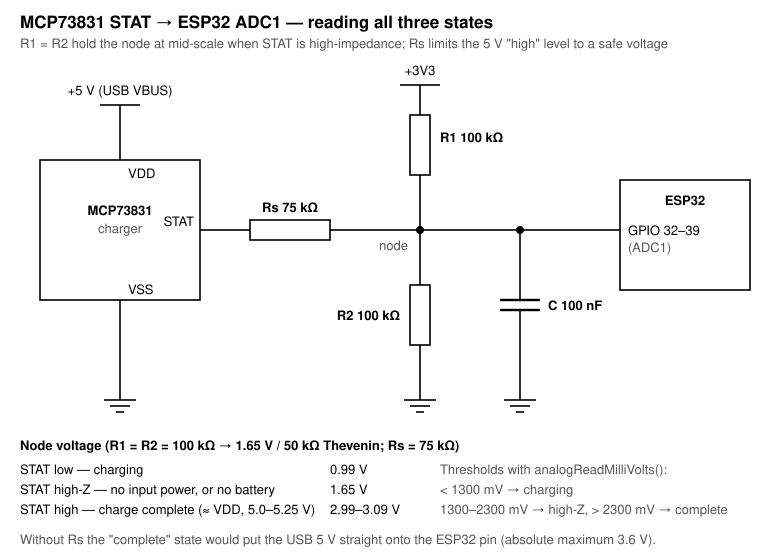

# PCBs

The custom boards of both consoles: everything needed to have them made, and to change them.

| Path | Contents |
|---|---|
| `easyeda/ProPrj_LittleGameConsole_2026-09-30.epro2` | LittleGameConsole: the editable EasyEDA Pro project - schematic and layout |
| `easyeda/ProPrj_TintinRocketShooter_2026-09-30.epro2` | TintinRocketShooter: the same |
| `gerber/Gerber_LittleGameConsolePCB_2026-09-30.zip` | LittleGameConsole: fabrication files, zipped as a fab expects them |
| `gerber/Gerber_PCB_TintinRocketShooter_2026-09-30.zip` | TintinRocketShooter: the same |
| `schematic_LittleGameConsole.pdf` | LittleGameConsole: the schematic as a document, readable without EasyEDA (6 sheets) |
| `schematic_TintinRocketShooter.pdf` | TintinRocketShooter: the same (7 sheets) |

The EasyEDA projects and the Gerber archives carry their export date in the file name, so a
later revision can sit beside these rather than silently replacing them.

## Ordering a board

Upload the Gerber archive of the console as it is - a standard Gerber and drill set. Nothing
in the design depends on a particular fab.

If you revise a layout, tag this repository when you order from it. A year later, "which
files made the board in my hand" then has an answer the tree alone cannot give.

## What is on the boards

From the schematics, the parts worth naming:

| Function | LittleGameConsole | TintinRocketShooter |
|---|---|---|
| Controller | ESP32-PICO-MINI-02U | ESP32-PICO-V3-02 |
| USB to serial, for flashing and the Serial Monitor | CP2102N | CP2102N |
| ESD protection of the USB lines | USBLC6-2SC6 | USBLC6-2SC6 |
| Li-ion charger | MCP73831 | MCP73831 |
| 3.3 V regulator | LD39200PUR, 2 A LDO | NCP167BMX330TBG, LDO |
| Battery fuel gauge | MAX17048 | MAX17048 |
| I2S class-D amplifier | MAX98357A | MAX98357A |

The display, the joystick and the buttons connect to the board; the GPIO of every signal is
in the wiring table of the top-level README, which mirrors each console's `PinMap.h`. The
same section names the three pins that need care in a new layout: GPIO 12 (flash voltage),
GPIO 2 (boot mode) and the input-only GPIO 34 to 39.

The schematic is the authority for what was actually built.

## Known errors on the TintinRocketShooter board

- **The battery connector sits too close to the display** and cannot be fitted. The
  battery's wires are soldered directly to the board instead.
- **The ESP32 reset button sits too close to the display**, which keeps it pressed.
- **The joystick is exposed to electrostatic discharge without its cap.** Touching the bare
  joystick can discharge into the board, and the firmware then hangs. Always fit the cap
  (`JoyTopCover` in [`mechanics/`](../mechanics)). A revision should add ESD protection to
  the joystick lines, or ground the joystick's metal housing.

A revision of this board should move the battery connector and the reset button clear of
the display.

## Ideas for the next revision

None of these is a fault - both boards work as built. They are traps for whoever reworks or
re-lays-out a board, and improvements collected while writing the firmware.

### Pins

1. **GPIO 12 - flash voltage.** GPIO 12 is latched at reset and selects the flash voltage;
   high means 1.8 V, and with 3.3 V flash the board then does not boot. Today it carries SPI
   MOSI, which idles low. Keep it free of anything that can pull it high - or fix the
   voltage for good with `espefuse.py set_flash_voltage 3.3V`, after checking with
   `espefuse.py summary` whether the module has already done so (`XPD_SDIO_FORCE`). Burning
   the eFuse is irreversible and must match the module's flash.
2. **Display bus on its native pins.** The ST7789 is driven at 40 MHz because MOSI on
   GPIO 12 is not one of HSPI's native pins, which routes the whole bus through the GPIO
   matrix. Swapping MOSI and RESET (12 ↔ 13) puts every signal on its native pin and allows
   80 MHz - raising the full-frame limit from about 32 to about 65 frames per second at
   320x240. 80 MHz overclocks the panel (the ST7789 specifies 62.5 MHz), so test it on
   several units. After the swap, RESET sits on GPIO 12: a pull-up on the panel's reset
   line would then stop the board from booting, so decide this together with item 1.
3. **I2S clocks off GPIO 5 and 19.** These are the Arduino defaults for SPI `SS` and `MISO`.
   Nothing calls `SPI.begin()` today, but a library that does would take over both I2S
   clocks.
4. **GPIO 2 and the backlight** (LittleGameConsole). GPIO 2 must be low or floating at reset
   for the serial bootloader. Driving the backlight from it works because `setup()` pulls it
   low first; a backlight circuit with a pull-up would break flashing.
5. **Buttons on GPIO 34 to 39** (TintinRocketShooter). These pins have no internal pull-ups,
   so Sel (36) and the joystick button (38) depend on external resistors. Keep them
   deliberately, or move the buttons to pins with internal pull-ups.

The I2C pins 21 and 22 are the reverse of the Arduino defaults. The firmware handles this
by calling `Wire.begin(cI2C_SDA, cI2C_SCL)` before any library starts the bus; a board that
uses the default order would not depend on that.

### Charging

6. **Charge sense for the LittleGameConsole.** The TintinRocketShooter shows a "+" at the
   battery while charging, from two signals: USB present, and the charger's STAT output.
   The LittleGameConsole has neither - its GPIO 25 and 26 are buttons. A revision needs two
   free pins, the analog one on ADC1 (GPIO 32 to 39). The firmware is ready: add the pins to
   `PinMap.h` and set `BOARD_HAS_CHARGE_SENSE()` to 1 in `Board.h`. Whether the MAX17048's
   own charge-rate reading can replace this without a hardware change is still being
   tested.
7. **Read all three states of STAT.** The MCP73831's STAT output is low while charging, high
   when charging is complete, and high-impedance with no input power or no battery. A
   digital input cannot tell high-impedance from high. Bias the sense node with two
   100 kΩ resistors to 3.3 V and ground, feed STAT through a **75 kΩ series resistor**, and
   add 100 nF to ground; one ADC reading then gives about 0.99 V (charging), 1.65 V
   (high-impedance) or 3.0 V (complete). The series resistor matters: the charger runs
   from USB, so STAT high is about 5 V, beyond the ESP32's 3.6 V maximum. Schematic:
   [`STAT_TriState.svg`](STAT_TriState.svg). On the current TintinRocketShooter board,
   check whether STAT already reaches GPIO 25 through a divider or series resistor.

### Larger changes

8. **ESP32-S3 with PSRAM.** Its DMA can read PSRAM, so a full-screen frame buffer in PSRAM
   could be sent to the display while the next frame is drawn; the display bus goes on
   native pins as in item 2; and it brings a faster core, a better ADC and native USB. The
   cost: FabGL does not support the S3, so the graphics move to TFT_eSPI or LovyanGFX, and
   the pin map starts over - different strapping pins (0, 3, 45, 46), native USB on GPIO
   19 and 20, octal PSRAM reserving GPIO 35 to 37, ADC1 on GPIO 1 to 10. The esp32 core
   2.0.17 supports the S3.
9. **A dedicated ADC for the joystick.** The ESP32's ADC is flat near both ends, bent above
   about 2.5 V, noisy, and not ratiometric to the potentiometers' supply; the firmware
   compensates with calibration, averaging and an expo curve. An **MCP3208** (or the
   4-channel MCP3204) on its own SPI pins, with `VREF` tied to the potentiometer supply,
   gives 12 linear, ratiometric bits in microseconds, plus spare channels for the battery
   or the STAT node. An **ADS1115** needs no new pins - it joins the I2C bus at 0x48 to
   0x4B - but converts at most about 400 times a second per axis and adds traffic to the
   bus the IMU is read on. On an ESP32-S3, measure the built-in ADC first. **Hall-effect
   joysticks** fix the other half of the problem - wear, drift and dead spots of the
   potentiometers - and work with either choice. In the firmware, `Joystick2Axis` reads
   through a single function, so an external ADC is a second implementation behind a
   `Board.h` setting.
